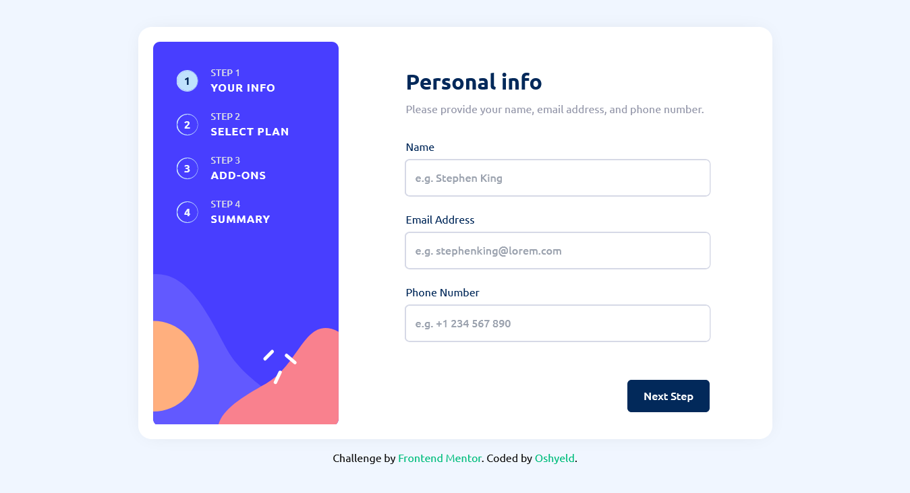

# Frontend Mentor - Multi-step form solution

This is a solution to the [Multi-step form challenge on Frontend Mentor](https://www.frontendmentor.io/challenges/multistep-form-YVAnSdqQBJ). Frontend Mentor challenges help you improve your coding skills by building realistic projects.

## Table of contents

- [Overview](#overview)
  - [The challenge](#the-challenge)
  - [Screenshot](#screenshot)
  - [Links](#links)
- [My process](#my-process)
  - [Built with](#built-with)
  - [What I learned](#what-i-learned)
  - [Useful resources](#useful-resources)
- [Author](#author)

## Overview

### The challenge

Users should be able to:

- Complete each step of the sequence
- Go back to a previous step to update their selections
- See a summary of their selections on the final step and confirm their order
- View the optimal layout for the interface depending on their device's screen size
- See hover and focus states for all interactive elements on the page
- Receive form validation messages if:
  - A field has been missed
  - The email address is not formatted correctly
  - A step is submitted, but no selection has been made

### Screenshot



### Links

- Solution URL: [Add solution URL here](https://your-solution-url.com)
- Live Site URL: [Add live site URL here](https://your-live-site-url.com)

## My process

### Built with

- Semantic HTML5 markup
- CSS custom properties
- Flexbox
- CSS Grid
- [Typescript](https://www.typescriptlang.org/)
- [Tailwind CSS](https://tailwindcss.com/) - For styles
- [Vue.js](https://vuejs.org/) - JS library
- [Pinia](https://pinia.vuejs.org/) - Vue.js store

### What I learned

- I wanted to use vue.js [teleport](https://vuejs.org/guide/built-ins/teleport.html) to create the nav buttons on mobile screens but finally, I found out that using old CSS "position: fixed" was better. Teleport had many settings I had to set up compared to the CSS solution.

- I had a performance warning in the browser due to the fixed positioning. And the solution was to use CSS [will-change](https://developer.mozilla.org/en-US/docs/Web/CSS/will-change) property.

Here is how I solved the issue :

```css
.stepButtons {
  /** ... */
  position: fixed;
  left: 0;
  bottom: 0;
  margin-bottom: 0;
  z-index: 999;

  will-change: transform;
}
```

### Useful resources

- [Deploy a vite app to Github Pages](https://dev.to/shashannkbawa/deploying-vite-app-to-github-pages-3ane) - 🥳 I actually found my solution in the top comment. I was following the article's steps but it wasn't working.
- [CSS will-change](https://developer.mozilla.org/en-US/docs/Web/CSS/will-change) - This helped me to fix a performance issue I had in the browser because of the use of CSS "position: fixed;".
- [Vue.js Reactive](https://vuejs.org/api/reactivity-core.html#reactive) - I had some issues with the second step related to the radio inputs because I was using computed properties : when I checked them, the style for the checked state was no longer applying. So I made the variable a reactive one and used shallowRef on the icons and the issues were fixed.

## Author

- Frontend Mentor - [@dinadess](https://www.frontendmentor.io/profile/dinadess)
